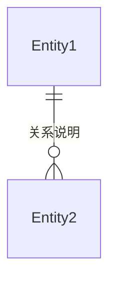

# 需求分析文档

<!--
  此模板用于生成结构化的需求分析文档，便于AI阅读和后续代码生成。
  请按照以下结构填写，确保所有必需章节（背景、功能验收标准）都已包含。
-->

## 文档元数据

| 属性         | 值                     |
| :----------- | :--------------------- |
| **需求名称** | [需求名称，简洁明确]   |
| **需求ID**   | [REQ-XXX]              |
| **创建日期** | [YYYY-MM-DD]           |
| **负责人**   | [负责人姓名]           |
| **优先级**   | [P0/P1/P2/P3]          |
| **状态**     | [待分析/分析中/已完成] |
| **关联任务** | [TASK-XXX]             |

---

## 背景

<!--
  必需章节：描述需求的背景、动机和要解决的问题。
  应包含：业务背景、用户痛点、当前状态、期望改进等。
-->

### 业务背景

[描述业务背景，说明为什么需要这个需求]

### 问题描述

[清晰描述当前存在的问题或痛点]

### 目标用户

[描述目标用户群体和使用场景]

---

## 需求概述

<!-- 简要描述需求的核心内容和价值 -->

[用1-2段话概括需求的核心内容、预期价值和影响范围]

---

## 功能需求

<!-- 详细列出所有功能点，使用结构化格式便于AI解析 -->

### 核心功能

#### 功能点 1: [功能名称]

**描述**: [功能点的详细描述]

**用户故事**: 作为 [角色]，我希望 [目标]，以便 [价值]

**输入**:

- [输入项1]
- [输入项2]

**输出**:

- [输出项1]
- [输出项2]

**业务规则**:

- [规则1]
- [规则2]

#### 功能点 2: [功能名称]

[按照上述格式继续描述其他功能点]

### 辅助功能

[描述非核心但必要的辅助功能]

---

## 功能验收标准

<!--
  必需章节：明确定义功能需求完成的判断标准。
  使用场景化描述，便于后续测试和验证。
-->

#### 场景 1: [场景名称]

- **GIVEN**: [前置条件]
- **WHEN**: [触发动作]
- **THEN**: [预期结果]
  - [结果1]
  - [结果2]

#### 场景 2: [场景名称]

[按照上述格式继续描述其他验收场景]

---

## 约束条件

<!-- 技术、业务、时间等方面的约束 -->

### 技术约束

- [技术约束1，如：必须使用特定框架、不能使用某些技术等]
- [技术约束2]

### 业务约束

- [业务约束1，如：必须符合某些业务规则、法规要求等]
- [业务约束2]

### 时间约束

- **截止日期**: [YYYY-MM-DD]
- **里程碑**: [关键时间节点]

### 资源约束

- [资源约束1，如：人力、预算等限制]
- [资源约束2]

---

## 依赖关系

<!-- 明确需求的依赖项和被依赖项 -->

### 前置依赖

- [依赖项1]: [说明依赖关系和影响]
- [依赖项2]: [说明依赖关系和影响]

### 后续影响

- [被依赖项1]: [说明对其他需求或功能的影响]
- [被依赖项2]: [说明对其他需求或功能的影响]

---

## 风险评估

<!-- 识别潜在风险和应对措施 -->

### 技术风险

| 风险项  |  风险等级  | 影响       | 应对措施   |
| :------ | :--------: | :--------- | :--------- |
| [风险1] | [高/中/低] | [影响描述] | [应对措施] |
| [风险2] | [高/中/低] | [影响描述] | [应对措施] |

### 业务风险

| 风险项  |  风险等级  | 影响       | 应对措施   |
| :------ | :--------: | :--------- | :--------- |
| [风险1] | [高/中/低] | [影响描述] | [应对措施] |
| [风险2] | [高/中/低] | [影响描述] | [应对措施] |

---

## 数据模型

<!-- 如果涉及数据，描述数据结构和关系 -->

### 实体定义

#### 实体 1: [实体名称]

| 字段名  |  类型  |  必填   | 说明   | 示例   |
| :------ | :----: | :-----: | :----- | :----- |
| [字段1] | [类型] | [是/否] | [说明] | [示例] |
| [字段2] | [类型] | [是/否] | [说明] | [示例] |

#### 实体 2: [实体名称]

[按照上述格式继续描述其他实体]

### 关系说明

[描述实体之间的关系，可以使用Mermaid图]



---

## 接口定义

<!-- 如果涉及API接口，描述接口规范 -->

### API 接口 1: [接口名称]

- **路径**: `[HTTP方法] /api/path`
- **描述**: [接口功能描述]
- **请求参数**:
  ```json
  {
    "param1": "类型 - 说明",
    "param2": "类型 - 说明"
  }
  ```
- **响应格式**:
  ```json
  {
    "code": "响应码",
    "data": {
      "field1": "类型 - 说明"
    },
    "message": "响应消息"
  }
  ```
- **错误码**:
  - `ERR_XXX`: [错误说明]

### API 接口 2: [接口名称]

[按照上述格式继续描述其他接口]

---

## 关联文档

<!-- 关联的UI/UX设计和测试文档 -->

- **UI/UX设计文档**: [如存在，引用 ux-tpl.md 生成的文档]
- **测试文档**: [如存在，引用 test-tpl.md 生成的文档，包含非功能验收标准和测试用例]

---

## 参考资料

<!-- 相关的文档、设计稿、原型等 -->

- [参考文档1]: [链接或路径]
- [参考文档2]: [链接或路径]
- [设计稿]: [链接或路径]
- [原型]: [链接或路径]

---

## 备注

<!-- 其他需要说明的信息 -->

[补充说明、待确认事项、特殊说明等]

---

## 变更记录

<!-- 记录需求变更历史 -->

| 版本 | 日期         | 变更内容 | 变更人 |
| :--- | :----------- | :------- | :----- |
| v1.0 | [YYYY-MM-DD] | 初始版本 | [姓名] |
