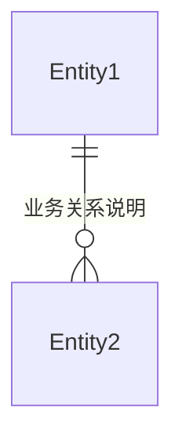

# 需求分析文档

<!--
  此模板用于生成结构化的需求分析文档，便于AI阅读和后续技术方案设计。

  职责定位：
  - 描述"做什么"（What）：业务需求、功能需求、业务规则
  - 定义业务层面的接口规范和数据模型
  - 不涉及技术实现细节（技术实现应在技术方案文档中定义）

  请按照以下结构填写，确保所有必需章节（背景、功能验收标准）都已包含。
-->

## 文档元数据

| 属性         | 值                     |
| :----------- | :--------------------- |
| **需求名称** | [需求名称，简洁明确]   |
| **需求 ID**  | [REQ-XXX]              |
| **创建日期** | [YYYY-MM-DD]           |
| **负责人**   | [负责人姓名]           |
| **优先级**   | [P0/P1/P2/P3]          |
| **状态**     | [待分析/分析中/已完成] |
| **关联任务** | [TASK-XXX]             |

---

## 背景

<!--
  必需章节：描述需求的背景、动机和要解决的问题。
  应包含：业务背景、用户痛点、当前状态、期望改进等。
-->

### 业务背景

[描述业务背景，说明为什么需要这个需求]

### 问题描述

[清晰描述当前存在的问题或痛点]

### 目标用户

[描述目标用户群体和使用场景]

---

## 版本支持

<!--
  明确说明该需求需要实现的平台版本和支持情况。
  需要明确是否支持 desktop（桌面端）和 mweb（移动端网页）。
-->

### 平台支持

| 平台类型    | 是否支持 | 说明                                                                                      |
| :---------- | :------- | :---------------------------------------------------------------------------------------- |
| **Desktop** | [是/否]  | [如支持，说明支持的桌面端类型，如：Web Desktop、Electron、原生应用等；如不支持，说明原因] |
| **MWeb**    | [是/否]  | [如支持，说明支持的移动端浏览器类型和版本要求；如不支持，说明原因]                        |

### 版本说明

<!-- 如有其他版本相关说明，在此补充 -->

- [版本相关说明 1，如：仅支持特定版本、有版本限制等]
- [版本相关说明 2]

---

## 需求概述

<!-- 简要描述需求的核心内容和价值 -->

[用 1-2 段话概括需求的核心内容、预期价值和影响范围]

---

## 功能需求

<!-- 详细列出所有功能点，使用结构化格式便于AI解析 -->

### 核心功能

#### 功能点 1: [功能名称]

**描述**: [功能点的详细描述]

**用户故事**: 作为 [角色]，我希望 [目标]，以便 [价值]

**输入**:

- [输入项 1]
- [输入项 2]

**输出**:

- [输出项 1]
- [输出项 2]

**业务规则**:

- [规则 1]
- [规则 2]

#### 功能点 2: [功能名称]

[按照上述格式继续描述其他功能点]

### 辅助功能

[描述非核心但必要的辅助功能]

---

## 功能验收标准

<!--
  必需章节：明确定义功能需求完成的判断标准。
  使用场景化描述，便于后续测试和验证。
-->

#### 场景 1: [场景名称]

- **GIVEN**: [前置条件]
- **WHEN**: [触发动作]
- **THEN**: [预期结果]
  - [结果 1]
  - [结果 2]

#### 场景 2: [场景名称]

[按照上述格式继续描述其他验收场景]

---

## 约束条件

<!-- 技术、业务、时间等方面的约束 -->

### 技术约束

- [技术约束 1，如：必须使用特定框架、不能使用某些技术等]
- [技术约束 2]

### 业务约束

- [业务约束 1，如：必须符合某些业务规则、法规要求等]
- [业务约束 2]

### 时间约束

- **截止日期**: [YYYY-MM-DD]
- **里程碑**: [关键时间节点]

### 资源约束

- [资源约束 1，如：人力、预算等限制]
- [资源约束 2]

---

## 依赖关系

<!-- 明确需求的依赖项和被依赖项 -->

### 前置依赖

- [依赖项 1]: [说明依赖关系和影响]
- [依赖项 2]: [说明依赖关系和影响]

### 后续影响

- [被依赖项 1]: [说明对其他需求或功能的影响]
- [被依赖项 2]: [说明对其他需求或功能的影响]

---

## 风险评估

<!-- 识别潜在风险和应对措施 -->

### 技术风险

| 风险项   |  风险等级  | 影响       | 应对措施   |
| :------- | :--------: | :--------- | :--------- |
| [风险 1] | [高/中/低] | [影响描述] | [应对措施] |
| [风险 2] | [高/中/低] | [影响描述] | [应对措施] |

### 业务风险

| 风险项   |  风险等级  | 影响       | 应对措施   |
| :------- | :--------: | :--------- | :--------- |
| [风险 1] | [高/中/低] | [影响描述] | [应对措施] |
| [风险 2] | [高/中/低] | [影响描述] | [应对措施] |

---

## 数据模型

<!--
  业务层面的数据模型定义，描述业务实体、属性和业务关系。
  技术实现的数据结构（如数据库表结构、TypeScript类型）应在技术方案文档中设计。
-->

### 实体定义

#### 实体 1: [实体名称]

- **业务含义**: [实体在业务中的含义和作用]
- **属性定义**:

| 字段名   |  类型  |  必填   | 业务说明   | 业务规则   | 示例   |
| :------- | :----: | :-----: | :--------- | :--------- | :----- |
| [字段 1] | [类型] | [是/否] | [业务含义] | [业务规则] | [示例] |
| [字段 2] | [类型] | [是/否] | [业务含义] | [业务规则] | [示例] |

#### 实体 2: [实体名称]

[按照上述格式继续描述其他实体]

### 业务关系说明

<!-- 描述实体之间的业务关系，可以使用Mermaid图 -->

[描述实体之间的业务关系，如：用户与订单是一对多关系等]



---

## 接口定义

<!--
  业务层面的接口规范定义，描述接口的业务功能、输入输出和业务规则。
  包括具体的endpoint、请求/响应格式、参数定义等接口规范信息。
  技术实现细节（如调用方式、错误处理、数据转换等）应在技术方案文档中定义。

  重要：如果此需求不需要对接API接口（如纯前端功能、静态数据处理等），
  请在此章节明确说明"此需求不需要对接API接口"。
-->

<!--
  如果此需求不需要对接API接口，请在此处明确说明：

  **此需求不需要对接API接口**

  说明：此需求为纯前端功能/静态数据处理/本地存储等，无需后端API支持。

  如果需求需要API接口，请继续填写下面的接口定义内容。
-->

### 接口参考（如有提供）

<!--
  如果用户提供了接口参考（如Swagger文档、Postman集合、接口文档等），
  请在此处整理和引用相关接口定义。
-->

#### 参考来源

- **参考文档**: [参考文档名称或链接]
- **参考类型**: [如：Swagger、Postman、接口文档等]
- **接口列表**: [列出参考文档中的相关接口]

#### 参考接口整理

<!-- 整理用户提供的接口参考，包括接口定义、参数说明等 -->

##### 参考接口 1: [接口名称]

- **Endpoint**: `[HTTP方法] /api/[path]`
- **参考说明**: [从参考文档中提取的接口说明]
- **原始定义**: [如有，可引用原始接口定义]

[按照上述格式继续整理其他参考接口]

### 接口 1: [接口名称]

- **Endpoint**: `[HTTP方法] /api/[path]`
- **功能描述**: [接口的业务功能描述，说明该接口要解决什么业务问题]
- **业务场景**: [在什么业务场景下使用此接口]
- **认证方式**: [如：Bearer Token、API Key、Session 等]

#### 请求参数

##### 路径参数

| 参数名   | 类型   |  必填   | 业务说明   | 业务规则   | 示例   |
| :------- | :----- | :-----: | :--------- | :--------- | :----- |
| [参数 1] | [类型] | [是/否] | [业务含义] | [业务规则] | [示例] |

##### 查询参数（GET 请求）

| 参数名   | 类型   |  必填   | 业务说明   | 业务规则    | 默认值   | 示例   |
| :------- | :----- | :-----: | :--------- | :---------- | :------- | :----- |
| [参数 1] | [类型] | [是/否] | [业务含义] | [业务规则]  | [默认值] | [示例] |
| page     | number |   否    | 页码       | 最小值: 1   | 1        | 1      |
| pageSize | number |   否    | 每页数量   | 范围: 1-100 | 10       | 10     |

##### 请求体（POST/PUT/PATCH 请求）

```json
{
  "field1": "string", // 必填 - 字段业务说明
  "field2": 123, // 可选 - 字段业务说明
  "field3": {
    // 可选 - 嵌套对象说明
    "nested1": "string",
    "nested2": 456
  }
}
```

**请求体字段说明**:

| 字段名 | 类型   | 必填 | 业务说明   | 业务规则   | 示例   |
| :----- | :----- | :--: | :--------- | :--------- | :----- |
| field1 | string |  是  | [业务含义] | [业务规则] | [示例] |
| field2 | number |  否  | [业务含义] | [业务规则] | [示例] |
| field3 | object |  否  | [业务含义] | [业务规则] | [示例] |

#### 响应格式

##### 成功响应

```json
{
  "success": true,
  "data": {
    "rows": [
      {
        "id": "1",
        "field1": "示例值1",
        "field2": 123
      }
    ]
  },
  "timestamp": 1702989203989
}
```

**响应字段说明**:

| 字段名    | 类型    | 业务说明       | 示例          |
| :-------- | :------ | :------------- | :------------ |
| success   | boolean | 请求是否成功   | true          |
| data      | object  | 响应数据对象   | -             |
| data.rows | array   | 数据行数组     | []            |
| timestamp | number  | 时间戳（毫秒） | 1702989203989 |

##### 错误响应

```json
{
  "success": false,
  "error": {
    "code": "ERR_XXX",
    "message": "错误信息描述"
  },
  "timestamp": 1702989203989
}
```

#### 业务规则

- [规则 1：如参数校验规则、业务逻辑规则等]
- [规则 2]

#### 异常情况

| 错误码    | HTTP 状态码 | 业务异常场景和说明   |
| :-------- | :---------- | :------------------- |
| ERR_XXX   | 400         | [业务异常场景和说明] |
| ERR_XXX_2 | 404         | [业务异常场景和说明] |

### 接口 2: [接口名称]

[按照上述格式继续描述其他接口]

---

## 本地存储需求

<!--
  明确说明此需求是否需要在localStorage中保存状态。
  如果有，需要详细说明存储的数据、存储时机、使用场景等。
  如果没有，也需要明确说明。
-->

### 是否需要 localStorage

<!--
  请选择以下两种情况之一：

  情况1：不需要localStorage
  **此需求不需要使用localStorage存储状态**

  情况2：需要使用localStorage
  继续填写下面的详细说明
-->

### 存储数据定义

<!-- 如果需要使用localStorage，请详细说明以下内容 -->

#### 存储项 1: [存储项名称]

- **存储键名**: `[localStorage key名称]`
- **业务含义**: [说明此存储项的业务含义和用途]
- **存储时机**: [说明在什么业务场景下存储此数据，如：用户操作后、页面加载时等]
- **使用场景**: [说明在什么场景下读取和使用此数据]
- **数据格式**: [说明存储的数据格式，如：JSON 字符串、简单字符串等]

**存储数据结构**:

```json
{
  "field1": "value1", // 字段说明
  "field2": 123, // 字段说明
  "field3": {
    // 嵌套对象说明
    "nested1": "value",
    "nested2": 456
  }
}
```

**字段说明**:

| 字段名 | 类型   | 必填 | 业务说明   | 业务规则   | 示例   |
| :----- | :----- | :--: | :--------- | :--------- | :----- |
| field1 | string |  是  | [业务含义] | [业务规则] | [示例] |
| field2 | number |  否  | [业务含义] | [业务规则] | [示例] |
| field3 | object |  否  | [业务含义] | [业务规则] | [示例] |

**业务规则**:

- [规则 1：如数据有效期、数据清理规则等]
- [规则 2]

#### 存储项 2: [存储项名称]

[按照上述格式继续描述其他存储项]

### 数据清理策略

<!-- 说明localStorage数据的清理时机和策略 -->

- [清理策略 1，如：用户登出时清理、数据过期时清理等]
- [清理策略 2]

---

## 关联文档

<!-- 关联的UI/UX设计和测试文档 -->

- **UI/UX 设计文档**: [如存在，引用 ux-tpl.md 生成的文档]
- **测试文档**: [如存在，引用 test-tpl.md 生成的文档，包含非功能验收标准和测试用例]

---

## 参考资料

<!-- 相关的文档、设计稿、原型等 -->

- [参考文档 1]: [链接或路径]
- [参考文档 2]: [链接或路径]
- [设计稿]: [链接或路径]
- [原型]: [链接或路径]

---

## 备注

<!-- 其他需要说明的信息 -->

[补充说明、待确认事项、特殊说明等]

---

## 变更记录

<!-- 记录需求变更历史 -->

| 版本 | 日期         | 变更内容 | 变更人 |
| :--- | :----------- | :------- | :----- |
| v1.0 | [YYYY-MM-DD] | 初始版本 | [姓名] |
