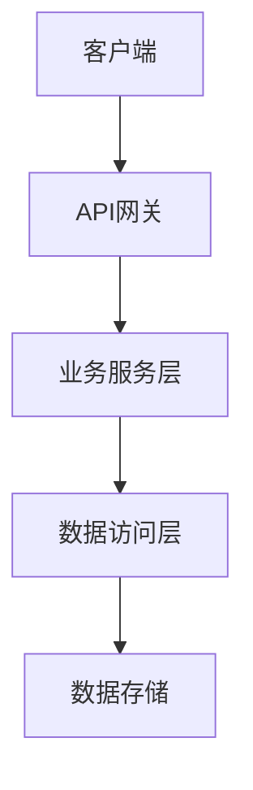

# 技术方案设计文档

<!--
  此模板用于生成结构化的技术方案设计文档，便于AI阅读和后续代码实现。
  请按照以下结构填写，确保所有必需章节都已包含。
-->

## 文档元数据

| 属性         | 值                     |
| :----------- | :--------------------- |
| **方案名称** | [技术方案名称]         |
| **方案ID**   | [TECH-XXX]             |
| **创建日期** | [YYYY-MM-DD]           |
| **负责人**   | [负责人姓名]           |
| **关联需求** | [REQ-XXX]              |
| **关联任务** | [TASK-XXX]             |
| **状态**     | [设计中/评审中/已通过] |

---

## 需求背景

<!--
  必需章节：引用关联的需求分析文档，说明技术方案的背景和目标。
-->

### 关联需求

- **需求文档**: [REQ-XXX] - [需求名称]
- **需求概述**: [简要描述需求的核心内容]

### 技术目标

[描述技术方案要达成的技术目标，如：性能提升、架构优化、功能实现等]

---

## 设计原则

<!-- 描述技术设计遵循的原则 -->

- [原则1，如：可扩展性、可维护性、高性能等]
- [原则2]
- [原则3]

---

## 方案概述

<!-- 简要描述技术方案的核心思路和整体架构 -->

[用1-2段话概括技术方案的核心思路、架构选型和关键技术点]

---

## 架构设计

<!--
  必需章节：描述系统的整体架构设计，包括分层架构、模块划分等。
-->

### 整体架构

[描述系统的整体架构，可以使用架构图]



### 架构分层

#### 表现层 (Presentation Layer)

- **职责**: [描述表现层的职责]
- **技术选型**: [使用的技术栈]
- **主要组件**: [组件列表]

#### 业务逻辑层 (Business Logic Layer)

- **职责**: [描述业务逻辑层的职责]
- **技术选型**: [使用的技术栈]
- **主要模块**: [模块列表]

#### 数据访问层 (Data Access Layer)

- **职责**: [描述数据访问层的职责]
- **技术选型**: [使用的技术栈]
- **主要组件**: [组件列表]

#### 数据存储层 (Data Storage Layer)

- **职责**: [描述数据存储层的职责]
- **技术选型**: [使用的技术栈]
- **存储方案**: [存储方案说明]

### 模块划分

#### 模块 1: [模块名称]

- **功能**: [模块功能描述]
- **职责**: [模块职责]
- **接口**: [对外提供的接口]
- **依赖**: [依赖的其他模块]

#### 模块 2: [模块名称]

[按照上述格式继续描述其他模块]

---

## API集成

<!--
  如果需求涉及API集成，请详细描述API的endpoint和字段定义。
  如果不需要API集成，可以删除此章节或标注"无"。
-->

### API集成概述

[简要说明需要集成的API类型和用途]

### API接口列表

#### API 1: [接口名称]

- **Endpoint**: `[HTTP方法] https://api.example.com/path`
- **描述**: [接口功能描述]
- **认证方式**: [如：Bearer Token、API Key等]
- **请求参数**:
  ```typescript
  {
    param1: string;      // 必填 - 参数说明
    param2?: number;      // 可选 - 参数说明
    param3: {
      field1: string;    // 嵌套对象字段说明
      field2: boolean;
    };
  }
  ```
- **请求示例**:
  ```json
  {
    "param1": "示例值1",
    "param2": 123,
    "param3": {
      "field1": "示例",
      "field2": true
    }
  }
  ```
- **响应格式**:
  ```typescript
  {
    code: number;         // 响应码
    data: {
      field1: string;     // 字段说明
      field2: number;
      field3?: {
        nested1: string;  // 嵌套字段说明
      };
    };
    message: string;      // 响应消息
    timestamp?: string;   // 时间戳（可选）
  }
  ```
- **响应示例**:
  ```json
  {
    "code": 200,
    "data": {
      "field1": "示例值",
      "field2": 456,
      "field3": {
        "nested1": "嵌套值"
      }
    },
    "message": "成功",
    "timestamp": "2024-01-01T00:00:00Z"
  }
  ```
- **错误码**:
  - `400`: [错误说明]
  - `401`: [错误说明]
  - `500`: [错误说明]

#### API 2: [接口名称]

[按照上述格式继续描述其他API接口]

---

## React组件设计

<!--
  如果需要创建共用的React组件，请详细描述组件的props、state和store设计。
  如果不需要创建共用组件，可以删除此章节或标注"无"。
-->

### 组件概述

[简要说明需要创建的共用组件及其用途]

### 组件列表

#### 组件 1: [组件名称]

- **功能描述**: [组件功能说明]
- **使用场景**: [组件在哪些场景下使用]
- **文件路径**: `packages/client/src/components/[路径]/[组件名].tsx`

##### Props设计

```typescript
interface [ComponentName]Props {
  // 必需属性
  prop1: string;              // 属性说明
  prop2: number;              // 属性说明

  // 可选属性
  prop3?: boolean;            // 属性说明，默认值: false
  prop4?: {
    nested1: string;          // 嵌套对象属性说明
    nested2?: number;         // 可选嵌套属性
  };

  // 事件回调
  onSubmit?: (data: FormData) => void;  // 提交事件回调
  onCancel?: () => void;                // 取消事件回调

  // 样式相关
  className?: string;         // 自定义样式类名
  style?: React.CSSProperties; // 内联样式
}
```

##### State设计

```typescript
interface [ComponentName]State {
  // 组件内部状态
  loading: boolean;           // 加载状态
  error: string | null;        // 错误信息
  data: DataType | null;       // 数据状态

  // 表单状态（如适用）
  formData: {
    field1: string;
    field2: number;
  };
}
```

##### Store设计（如使用状态管理）

```typescript
// 如果组件需要全局状态管理，描述store结构
interface [ComponentName]Store {
  // Store状态
  items: Item[];              // 数据列表
  selectedItem: Item | null;  // 当前选中项
  filters: FilterConfig;      // 筛选配置

  // Store Actions
  fetchItems: () => Promise<void>;
  selectItem: (id: string) => void;
  updateFilters: (filters: FilterConfig) => void;
  resetStore: () => void;
}
```

##### 使用示例

```typescript
// 组件使用示例
<[ComponentName]
  prop1="示例值"
  prop2={123}
  prop3={true}
  onSubmit={(data) => {
    console.log('提交数据:', data);
  }}
  onCancel={() => {
    console.log('取消操作');
  }}
/>
```

#### 组件 2: [组件名称]

[按照上述格式继续描述其他组件]

---

## Package设计

<!--
  如果需要新建package，请详细描述包的设计信息。
  如果不需要新建package，可以删除此章节或标注"无"。
-->

### Package概述

[简要说明需要新建的package及其用途]

### Package列表

#### Package 1: [包名]

- **包名**: `@orderly.network/[package-name]`
- **描述**: [包的详细描述和用途说明]
- **包类型**: [如：工具包、UI组件包、业务逻辑包等]
- **目录结构**:
  ```
  packages/[package-name]/
  ├── src/
  │   ├── index.ts          # 入口文件
  │   ├── [module1]/
  │   │   ├── index.ts
  │   │   └── [file].ts
  │   └── [module2]/
  │       └── index.ts
  ├── package.json
  └── tsconfig.json
  ```

##### 主要功能

- [功能1]: [功能描述]
- [功能2]: [功能描述]
- [功能3]: [功能描述]

##### 对外接口

```typescript
// 主要导出的接口和类型
export interface [InterfaceName] {
  // 接口定义
}

export class [ClassName] {
  // 类定义
}

export function [functionName](): void {
  // 函数定义
}

// 类型导出
export type [TypeName] = ...;
```

##### 依赖关系

- **内部依赖**:
  - `@specflow/[dep1]`: [依赖说明]
  - `@specflow/[dep2]`: [依赖说明]
- **外部依赖**:
  - `[external-package]`: [版本] - [依赖说明]

##### 使用示例

```typescript
import { [ClassName], [functionName] } from '@specflow/[package-name]';

// 使用示例代码
const instance = new [ClassName]();
[functionName]();
```

#### Package 2: [包名]

[按照上述格式继续描述其他package]

---

## 关联文档

<!-- 关联的需求、设计、测试文档 -->

- **需求分析文档**: [REQ-XXX] - [需求名称]
- **UI/UX设计文档**: [如存在，引用 ux-tpl.md 生成的文档]
- **测试文档**: [如存在，引用 test-tpl.md 生成的文档]

---

## 变更记录

<!-- 记录技术方案变更历史 -->

| 版本 | 日期         | 变更内容 | 变更人 |
| :--- | :----------- | :------- | :----- |
| v1.0 | [YYYY-MM-DD] | 初始版本 | [姓名] |
