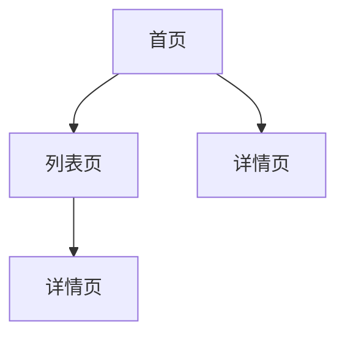
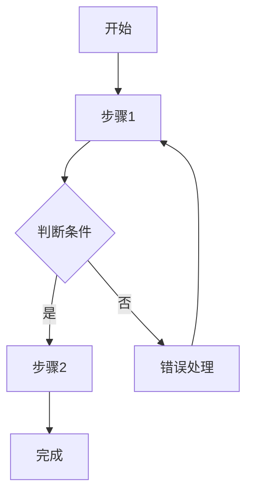

# UI/UX 设计文档

<!--
  此模板用于生成结构化的UI/UX设计文档，便于AI阅读和后续前端代码生成。
  请按照以下结构填写，确保设计信息完整且可执行。
-->

## 文档元数据

| 属性         | 值                     |
| :----------- | :--------------------- |
| **设计名称** | [设计名称，简洁明确]   |
| **设计ID**   | [UX-XXX]               |
| **创建日期** | [YYYY-MM-DD]           |
| **设计师**   | [设计师姓名]           |
| **关联需求** | [REQ-XXX]              |
| **关联任务** | [TASK-XXX]             |
| **状态**     | [设计中/评审中/已确认] |

---

## 设计背景

<!-- 描述设计的背景和目标 -->

### 业务目标

[描述通过UI/UX设计要达成的业务目标]

### 用户目标

[描述用户在使用该界面时的目标]

### 设计目标

[描述设计本身要达成的目标，如：提升转化率、改善用户体验等]

---

## 平台适配

<!-- 确认设计覆盖的平台版本 -->

### 平台版本确认

- [ ] **Desktop版本**: [是否包含桌面端设计，如：是/否]
  - [设计说明，如：主要布局、交互特点等]
- [ ] **mWeb版本**: [是否包含移动端Web设计，如：是/否]
  - [设计说明，如：主要布局、交互特点等]

### 平台差异说明

<!-- 如果Desktop和mWeb版本存在差异，请在此说明 -->

| 功能/组件 | Desktop版本 | mWeb版本 | 差异说明 |
| :-------- | :---------- | :------- | :------- |
| [功能1]   | [描述]      | [描述]   | [差异]   |
| [功能2]   | [描述]      | [描述]   | [差异]   |

---

## 页面结构

<!-- 描述页面的整体结构和布局 -->

### 页面层级

[描述页面的层级关系，可以使用Mermaid图]



### 页面布局

#### 页面 1: [页面名称]

**页面路径**: `/path/to/page`

**布局描述**:

- [布局特点1，如：顶部导航、侧边栏、主内容区等]
- [布局特点2]

**关键元素**:

- [元素1]: [位置和说明]
- [元素2]: [位置和说明]

**布局示意图**:

```
┌─────────────────────────────────┐
│          Header                 │
├──────────┬──────────────────────┤
│ Sidebar  │    Main Content      │
│          │                      │
│          │                      │
└──────────┴──────────────────────┘
```

#### 页面 2: [页面名称]

[按照上述格式继续描述其他页面]

---

## 交互流程

<!-- 描述用户与界面的交互流程 -->

### 核心流程

#### 流程 1: [流程名称]

**流程描述**: [简要描述流程的目的]

**用户目标**: [用户想要完成什么]

**交互步骤**:

1. **步骤1**: [用户操作]
   - **触发条件**: [什么情况下触发]
   - **界面反馈**: [界面如何响应]
   - **下一步**: [引导用户到下一步]

2. **步骤2**: [用户操作]
   - [详细说明]

**流程图**:



#### 流程 2: [流程名称]

[按照上述格式继续描述其他流程]

### 异常流程

#### 异常 1: [异常场景名称]

- **触发条件**: [什么情况下出现]
- **用户操作**: [用户可能的操作]
- **界面反馈**: [界面如何提示和处理]
- **恢复路径**: [如何恢复正常流程]

---

## 组件设计

<!-- 描述关键UI组件的设计规范 -->

### 通用组件

#### 组件 1: [组件名称]

**用途**: [组件的主要用途]

**使用场景**: [在什么情况下使用]

**属性定义**:

| 属性名  | 类型   | 必填 | 默认值 | 说明       |
| :------ | :----- | :--: | :----- | :--------- |
| [prop1] | [类型] | [是] | [默认] | [属性说明] |
| [prop2] | [类型] | [否] | [默认] | [属性说明] |

**状态定义**:

<!-- 请确认并描述组件的所有可能状态 -->

- [ ] **默认状态**: [描述默认外观]
- [ ] **悬停状态**: [描述鼠标悬停时的外观（如适用）]
- [ ] **激活状态**: [描述激活时的外观（如适用）]
- [ ] **禁用状态**: [描述禁用时的外观（如适用）]
- [ ] **加载状态**: [描述加载时的外观和交互反馈]
- [ ] **错误状态**: [描述错误时的外观和错误提示方式]
- [ ] **空状态**: [描述数据为空时的外观和提示内容]
- [ ] **成功状态**: [描述操作成功时的反馈（如适用）]
- [ ] **焦点状态**: [描述键盘焦点时的外观（如适用）]
- [ ] **其他状态**: [如有其他特殊状态，请补充]

**交互行为**:

- [交互行为1，如：点击、悬停、拖拽等]
- [交互行为2]

**设计稿**: [附上设计稿链接或截图]

#### 组件 2: [组件名称]

[按照上述格式继续描述其他组件]

### 页面特定组件

[描述只在特定页面使用的组件]

---

## 设计系统引用

<!-- 说明使用的设计系统 -->

**设计系统**: [团队设计系统名称，如：Ant Design / Material Design / 自定义设计系统]

**说明**: 本设计遵循团队统一的设计系统规范，包括色彩、字体、间距、圆角、阴影等视觉元素均使用设计系统中的标准值，无需在此文档中重复定义。

---

## 响应式设计

<!-- 定义不同屏幕尺寸下的设计规范，结合平台适配部分使用 -->

### 断点定义

<!-- 基于设计系统的断点定义 -->

| 设备类型 | 屏幕宽度   | 布局特点       |
| :------- | :--------- | :------------- |
| 移动端   | < 768px    | [布局特点说明] |
| 平板     | 768-1024px | [布局特点说明] |
| 桌面端   | > 1024px   | [布局特点说明] |

### 适配规则

#### Desktop版本适配

- [适配规则1，如：多列布局、侧边栏显示等]
- [适配规则2]

#### mWeb版本适配

- [适配规则1，如：单列布局、底部导航等]
- [适配规则2]

---

## 动效设计

<!-- 定义动画和过渡效果 -->

### 过渡动画

| 动画类型 | 持续时间 | 缓动函数 | 使用场景       |
| :------- | :------- | :------- | :------------- |
| 淡入淡出 | 200ms    | ease     | [使用场景说明] |
| 滑动     | 300ms    | ease-out | [使用场景说明] |
| 缩放     | 250ms    | ease-in  | [使用场景说明] |

### 交互动效

#### 动效 1: [动效名称]

- **触发条件**: [什么情况下触发]
- **动画描述**: [动画的具体表现]
- **持续时间**: [动画时长]
- **缓动函数**: [使用的缓动函数]

---

## 无障碍设计

<!-- 定义无障碍访问相关规范 -->

### 可访问性要求

- **键盘导航**: [支持键盘操作的说明]
- **屏幕阅读器**: [屏幕阅读器支持说明]
- **对比度**: [颜色对比度要求，如：WCAG AA级别]
- **焦点指示**: [焦点状态的视觉指示]

### 无障碍测试

- [ ] 所有交互元素可通过键盘访问
- [ ] 颜色对比度符合WCAG标准
- [ ] 图片提供替代文本
- [ ] 表单提供清晰的标签和错误提示

---

## 设计资源

<!-- 提供设计相关的资源链接 -->

### 设计稿

- [Figma设计稿]: [链接]
- [Sketch设计稿]: [链接]
- [设计规范文档]: [链接]

### 图标资源

- [图标库]: [链接或路径]
- [图标使用规范]: [说明]

### 图片资源

- [图片资源库]: [链接或路径]
- [图片使用规范]: [说明]

---

## 设计评审

<!-- 记录设计评审相关信息 -->

### 评审记录

| 版本 | 日期         | 评审内容     | 评审人 | 评审结果      |
| :--- | :----------- | :----------- | :----- | :------------ |
| v1.0 | [YYYY-MM-DD] | 初始设计评审 | [姓名] | [通过/需修改] |

### 待确认事项

- [ ] [待确认事项1]
- [ ] [待确认事项2]

---

## 备注

<!-- 其他需要说明的信息 -->

[补充说明、设计理念、特殊考虑等]
